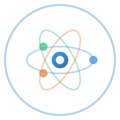

<div align="center">
  
  <h1>SciGym</h1>
  <p><strong>科研自动化工作流 — AI Agent Skill</strong></p>
  <p>
    <a href="README_EN.md">English</a>
  </p>
</div>

---

## SciGym 是什么？

SciGym 是一套**科研自动化工作流文档**，帮助 AI Agent 引导研究人员构建 24/7 自主运行的实验循环。

核心框架：**Benchmark（独立验证）→ 研究环境（CLI / Gym）→ AutoRun（自主执行）**

没有 Benchmark，RL 会自欺欺人；没有好的实验环境，探索成本过高；没有 AutoRun，人就被绑在机器旁边。三者缺一不可。

## 安装方法

把这个链接发给你的 Agent，让它自己读文档、按需安装：

```
https://github.com/Osgood001/scigym-skill
```

Agent 会读取对应的文档，与你交互确认细节，然后执行安装。

## 子文档说明

| 文档 | 内容 |
|------|------|
| [skills/scigym/SKILL.md](skills/scigym/SKILL.md) | 完整 pipeline 入口与总览 |
| [phase1-benchmark.md](skills/scigym/phase1-benchmark.md) | 从论文/硬件提取基准数据，编写验证脚本 |
| [phase2-gym.md](skills/scigym/phase2-gym.md) | CLI + logging 优先；Gymnasium / FastAPI 可选 |
| [phase3-interface.md](skills/scigym/phase3-interface.md) | Mock / 硬件 / HPC 后端统一切换 |
| [phase4-autorun.md](skills/scigym/phase4-autorun.md) | Cryochamber 配置、CLAUDE.md 任务描述、Zulip 推送 |
| [submit.md](skills/scigym/submit.md) | scigym.json 清单 + GitHub Topics + 注册表收录 |

## 核心设计原则

**研究环境三层（按需选择，不是高低）**
- **CLI + logging** — 最快落地，Agent 直接调用，最灵活
- **FastAPI server** — 有状态会话，多步实验共享上下文
- **Gymnasium env** — 维护运行中环境状态，底层对 Agent 不透明（防 reward hack），适合受限实验 / RL 训练 / 理论-实验混合研究

每步记录 `--motivation`（"为什么做这个实验"）+ obs + result，形成完整可追溯的研究日志。

**Benchmark 三原则**
1. **独立性** — 不能用训练 RL 的同一个模型做验证
2. **可审计** — 数据来源必须可追溯（论文 DOI / 实验记录）
3. **量化误差** — 给出置信区间，不接受"看起来差不多"

**AutoRun 安全规则**（写在 CLAUDE.md 里）
- 参数必须有边界检查
- 连续 N 次无改进 → hibernate，不乱跑

## 相关链接

- [scigym-registry](https://github.com/Osgood001/scigym-registry) — 自动发现注册表
- [GiggleLiu/cryochamber](https://github.com/GiggleLiu/cryochamber) — AI Agent 持久化框架

---

<div align="center">
  <sub>Powered by Cryochamber · Indexed by scigym-registry</sub>
</div>
